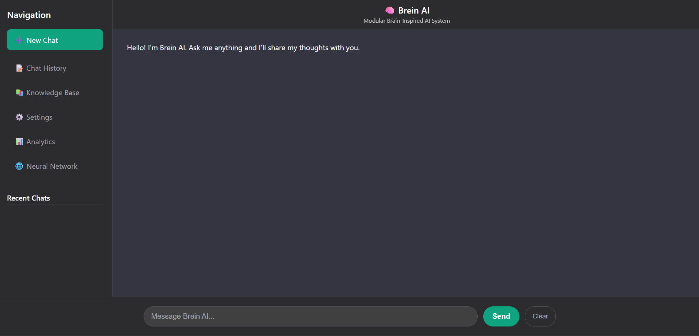

# Brein AI - Memory-First AI System


Brein AI is a revolutionary memory-first artificial intelligence system inspired by the human brain's architecture. It combines advanced vector databases, neural mesh learning, multi-agent processing, and comprehensive safety measures to create a powerful yet safe AI assistant.

## 📖 Table of Contents

- [🧠 Core Features](#-core-features)
- [🚀 Quick Start](#-quick-start)
- [💻 Usage](#-usage)
- [📚 API Documentation](#-api-documentation)
- [🏗️ System Architecture](#️-system-architecture)
- [🔧 Configuration](#-configuration)
- [🧪 Testing](#-testing)
- [📊 Performance Metrics](#-performance-metrics)
- [🔒 Security Features](#-security-features)
- [📱 Mobile Deployment](#-mobile-deployment)
- [🤝 Contributing](#-contributing)
- [📝 License](#-license)
- [🙏 Acknowledgments](#-acknowledgments)
- [📞 Support](#-support)

## 🧠 Core Features

### Memory-First Architecture
- **Vector Database**: FAISS-powered similarity search with SSD offload
- **Neural Mesh**: Hebbian learning for associative memory connections
- **Hierarchical Memory**: Working, long-term, and episodic memory types
- **LRU Caching**: Intelligent memory management for optimal performance

### Multi-Agent Brain Architecture
- **Hippocampus Agent**: Memory encoding and ingestion
- **Prefrontal Cortex Agent**: Complex reasoning and planning
- **Amygdala Agent**: Emotional intelligence and personality
- **Thalamus Router**: Intelligent query routing and model selection

### Safety & Security
- **Web Content Pipeline**: Fetch → Sanitize → Vet → Quarantine → Review → Ingest
- **Audit Logging**: Complete provenance tracking for all operations
- **Content Quarantine**: Human oversight for web content ingestion
- **Access Controls**: Per-query web access toggling

### Mobile & Offline Capabilities
- **Model Export**: ONNX/TFLite conversion for mobile deployment
- **Delta Sync**: Efficient synchronization between cloud and devices
- **Offline Bundles**: Pre-packaged data for offline operation

### Performance & Monitoring
- **Real-time Profiling**: System performance monitoring
- **Comprehensive Testing**: Automated test harness with 1000+ sample documents
- **Health Monitoring**: System health status and alerts

## 🚀 Quick Start

### Prerequisites
- Python 3.8+
- Git

### Installation

#### Option 1: Automated Installer (Recommended)
```bash
# Clone the repository
git clone https://github.com/AbduljabbarBXR/Brein-Ai.git
cd Brein-Ai

# Run the installer
python setup.py
```

#### Option 2: Manual Installation
```bash
# Clone the repository and navigate into it
git clone https://github.com/AbduljabbarBXR/Brein-Ai.git
cd Brein-Ai

# Create and activate a virtual environment
python -m venv brein_env
source brein_env/bin/activate  # On Windows use: brein_env\Scripts\activate

# Install the required dependencies
pip install -r requirements.txt

# Start the system
python backend/main.py
```

## 💻 Usage

### Starting the Server
To start the Brein AI server, run the following command in the project's root directory:

```bash
python backend/main.py
```

The API will be available at `http://localhost:8000`.

### Accessing the Web Interface
Once the server is running, you can access the web interface by opening the `frontend/index.html` file in your web browser.

### Making API Calls
You can interact with the Brein AI API using any HTTP client. Here is a Python example:

```python
import requests

# Define the API endpoint
url = "http://localhost:8000/api/query"

# Define the payload
payload = {
    "query": "Explain machine learning in simple terms.",
    "session_id": "user123"
}

# Send the POST request
response = requests.post(url, json=payload)

# Print the response
print(response.json())
```

## 📚 API Documentation

<details>
<summary><strong>Click to expand API Endpoints</strong></summary>

### Core Endpoints

#### Query Processing
```http
POST /api/query
Content-Type: application/json

{
  "query": "Your question here",
  "session_id": "optional_session_id",
  "enable_web_access": false
}
```

#### Memory Management
```http
GET /api/memory/stats          # Get memory statistics
GET /api/memory/search?q=term  # Search memory
POST /api/ingest              # Ingest new content
```

#### Web Content Integration
```http
POST /api/web/fetch           # Fetch web content (with safety pipeline)
GET /api/web/quarantine/list  # List quarantined content
POST /api/web/review          # Approve/reject quarantined content
```

#### Device Synchronization
```http
POST /api/sync/register-device  # Register mobile device
POST /api/sync/delta           # Get sync delta
POST /api/sync/apply-delta     # Apply sync changes
```

#### Testing & Monitoring
```http
POST /api/test/run-comprehensive  # Run full test suite
POST /api/profiler/start         # Start performance monitoring
GET /api/profiler/health         # Get system health status
```

</details>

## 🏗️ System Architecture

### Frontend Interfaces

<div align="center">
  
  <p><em>Figure 1: Brein AI Frontend Interface - Main user interaction dashboard</em></p>
</div>

<div align="center">
  
  <p><em>Figure 2: Knowledge Base Interface - Memory and content management</em></p>
</div>

<div align="center">
  
  <p><em>Figure 3: Neural Mesh Visualization - Interactive associative memory network</em></p>
</div>

<div align="center">
  
  <p><em>Figure 4: System Analytics Dashboard - Performance monitoring and health metrics</em></p>
</div>

<details>
<summary><strong>Click to expand detailed System Architecture Diagrams</strong></summary>

### Core System Architecture

<div align="center">
  
  <p><em>Figure 5: Core System Architecture - Complete data flow from user interfaces to memory storage</em></p>
</div>

### Brain-Inspired Multi-Agent Architecture

<div align="center">
  
  <p><em>Figure 6: Brain-Inspired Multi-Agent Architecture - Four specialized agents coordinated through SAL</em></p>
</div>

### SAL Communication Flow

<div align="center">
  
  <p><em>Figure 7: SAL Communication Flow - Real-time inter-agent coordination and state management</em></p>
</div>

</details>

## 🔧 Configuration

Create a `config.json` file in the installation directory with the following structure:

```json
{
  "database": {
    "path": "memory/brein_memory.db"
  },
  "models": {
    "embedding_model": "all-MiniLM-L6-v2"
  },
  "server": {
    "host": "127.0.0.1",
    "port": 8000
  },
  "security": {
    "web_access_default": false,
    "audit_enabled": true
  }
}
```

## 🧪 Testing

### Run Comprehensive Tests
To run the full test suite with over 1000 documents, use the following cURL command:

```bash
curl -X POST http://localhost:8000/api/test/run-comprehensive
```

### Performance Benchmarking
To run a performance benchmark, use this command:

```bash
curl -X POST http://localhost:8000/api/test/benchmark -d '{"iterations": 100}'
```

### Performance Monitoring
You can start real-time monitoring and fetch current metrics with these commands:

```bash
# Start real-time monitoring
curl -X POST http://localhost:8000/api/profiler/start

# Get current metrics
curl http://localhost:8000/api/profiler/current
```

## 📊 Performance Metrics

- **Memory Ingestion**: ~50-200 docs/second (depending on content length)
- **Query Processing**: ~100-500ms average response time
- **Concurrent Users**: Supports 10+ simultaneous queries
- **Memory Scaling**: Handles millions of vectors with SSD offload
- **Storage Efficiency**: ~1KB per memory node (vector + metadata)

## 🔒 Security Features

- **Content Sanitization**: Removes malicious scripts and suspicious patterns
- **Domain Trust Scoring**: Configurable trusted domains list
- **Audit Trails**: Complete logging of all operations and decisions
- **Access Controls**: Granular permissions for web access and data operations
- **Data Provenance**: Full tracking of content sources and transformations

## 📱 Mobile Deployment

### Export Models for Mobile
To export the embedding model to TFLite, use the following command:

```bash
curl -X POST http://localhost:8000/api/models/export-mobile-bundle \
  -d '{"bundle_name": "brein_mobile_v1"}'
```

### Device Registration
Register a new mobile device with this cURL command:

```bash
curl -X POST http://localhost:8000/api/sync/register-device \
  -d '{
    "device_id": "mobile_001",
    "device_name": "iPhone 14",
    "device_type": "mobile",
    "capabilities": ["offline_mode", "sync"]
  }'
```

## 🤝 Contributing

Contributions are welcome! Please follow these steps:

1. Fork the repository
2. Create a new feature branch (`git checkout -b feature/amazing-feature`)
3. Commit your changes (`git commit -m 'Add amazing feature'`)
4. Push to the branch (`git push origin feature/amazing-feature`)
5. Open a Pull Request

## 📝 License

This project is licensed under the MIT License. See the LICENSE file for more details.

## 🙏 Acknowledgments

- **FAISS**: For efficient similarity search
- **Sentence Transformers**: For text embedding models
- **FastAPI**: For the REST API framework
- **SQLite**: For metadata storage
- **BeautifulSoup**: For web content parsing

## 📞 Support

- **Documentation**: [Brein AI Docs](https://github.com/AbduljabbarBXR/Brein-Ai)
- **Discussions**: abdijabarboxer2009@gmail.com

---

<div align="center">
  <strong>Built with ❤️ for the future of AI</strong>
</div>
